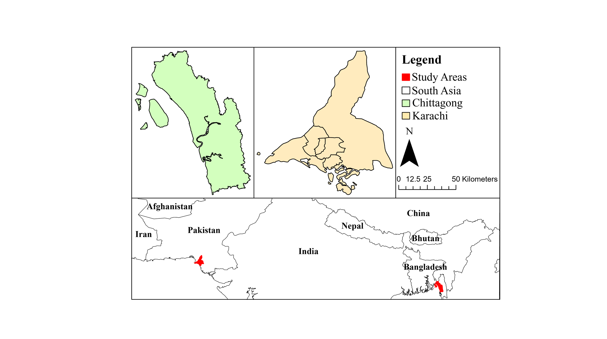
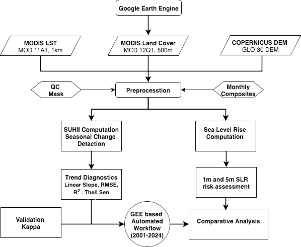
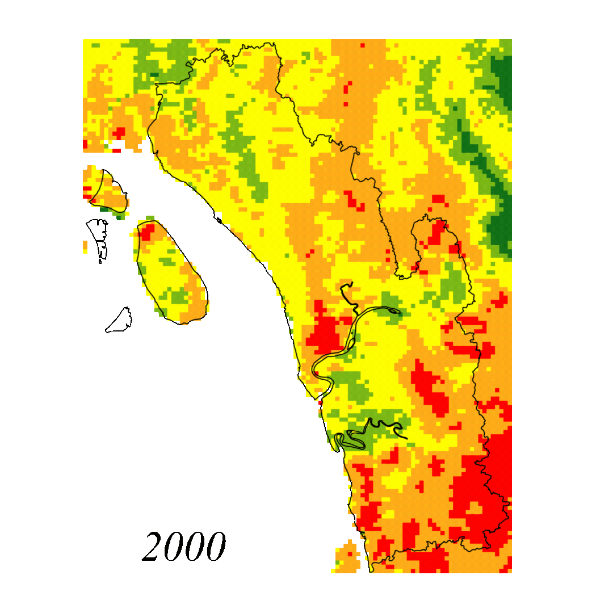

# Surface Urban Heat Island Dynamics in Contrasting Coastal Climates: Chittagong and Karachi

**Research project** · Presented at a conference · Manuscript in preparation

> **Status:** unpublished. This page shows the research question, study area, data and method overview only.
> **Full results and code will be released after publication.**

## Research question

Chittagong (Bangladesh) and Karachi (Pakistan) are both fast-growing coastal megacities in V20 countries, the group of nations most vulnerable to climate change, but they sit in opposite climates: hot-humid tropical versus hot-arid subtropical. The study asks:

1. How does surface urban heat island intensity (SUHII) differ between the two cities over 2000–2024?
2. How does it vary by season and from year to year?
3. Where are the recurring intra-urban heat hotspots, and how do they overlap with areas exposed to sea-level rise?

## Study area

## Data

| Dataset | Use | Resolution |
|---|---|---|
| MODIS/Terra Land Surface Temperature, MOD11A1 (daily) | Land surface temperature (LST) | ~1 km |
| MODIS Land Cover Type, MCD12Q1 (annual, IGBP classes) | Urban (built-up) and rural reference masks | 500 m, resampled to 1 km |
| Copernicus GLO-30 DEM | Low-lying areas for sea-level-rise exposure | 30 m, resampled to 1 km |

## Method overview

- A fully automated, reproducible workflow in **Google Earth Engine**.
- Quality-flag cloud masking, then seasonal LST composites for **April (pre-monsoon)** and **November (post-monsoon)** each year.
- SUHII measured as the urban–rural LST difference, at city scale and per pixel.
- Trend diagnostics: OLS slope, Mann–Kendall test and Theil–Sen estimator.
- Hotspot classification of the SUHII maps and overlay with 1 m and 5 m sea-level-rise inundation scenarios.
- Comparative analysis of the humid and arid city.

## Example output

*Per-pixel SUHII classes for Chittagong in April 2000, the first year of the annual series. The legend and the full 2000–2024 series will appear in the paper.*

## Tools

Google Earth Engine (JavaScript API) · GIS cartography

## Contact

Chinmoy Ghosh Shuvo · Open to collaboration and knowledge sharing. Feel free to reach out on [LinkedIn](https://www.linkedin.com/in/chinmoyghosh034).

*Full results and code will be released after publication.*
